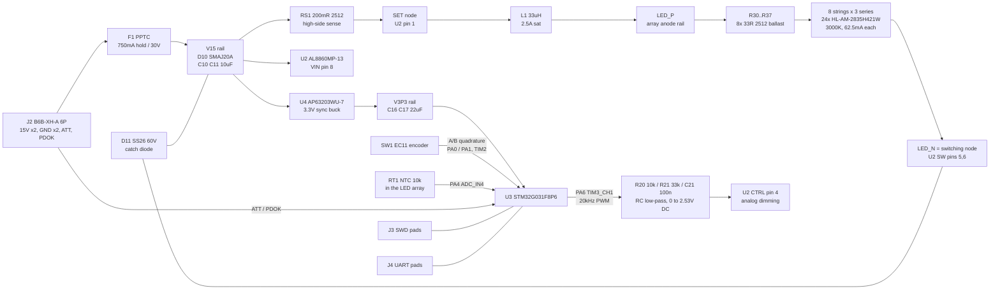

Board L is everything that is not USB-PD negotiation: the constant-current LED driver,
the LED array itself, the 3.3 V logic rail, the control MCU, and the knob. It consumes
the switched 15 V rail from [Board P](./board-p.mdx) and nothing else.

## Block diagram



## LED array and the brightness number

The [LED candidates](/docs/research/led-candidates/) page left CCT open. For a
fire/candle effect the answer is **warm**, and warm is exactly where the JLCPCB stock
sits: `HL-AM-2835H421W-S1-08-HR3` ([C210315](https://jlcpcb.com/partdetail/C210315)) at
399,813 units, in the 2800–3100 K bin.

Its manufacturer specification (Honglitronic B-17-A-0596 Rev A/2) gives real optical
numbers, which the parts DB does not:

| Parameter | Value (at IF = 60 mA) |
|---|---|
| Luminous flux, 2800–3100 K bin | **26 lm min, 29 lm typical** |
| CCT typical | 3000 K |
| CRI (Ra) | 80 min |
| Forward voltage | 2.6 V min, 3.2 V max (±0.1 V measurement tolerance) |
| Viewing angle | 120° |
| Package rating | 306 mW |

### Arrangement

**8 parallel strings of 3 series LEDs = 24 emitters, 500 mA total, 62.5 mA per string.**

3-series was chosen over 4-series. The [headroom analysis](/docs/research/led-candidates/#voltage-headroom-analysis)
called 4s "tight"; with this part's datasheet Vf ceiling of 3.2 V a 4s string is 12.8 V,
which puts the buck at **85% duty** — outside the AL8860's recommended 25–75% duty band
(DS39014 Rev 5, "Recommended Duty Cycle Range"). 3s plus a ballast resistor lands at
**74%**, just inside it.

### Brightness

| | Value |
|---|---|
| Typical flux | 24 x 29 lm = **~700 lm** |
| Worst-case bin | 24 x 26 lm = **624 lm** |
| System efficacy | ~700 lm / 6.16 W = **114 lm/W** |

For scale: a 60 W incandescent bulb is about 800 lm, and a typical decorative table lamp
is 300–600 lm. ~700 lm through a diffuser is a genuinely bright ambient lamp, and the
modulation spends most of its time below full scale.

The flux figures are read at the datasheet's 60 mA test point; the design runs 62.5 mA
(+4%), so the real number is marginally higher. It is quoted at the 60 mA value rather
than extrapolated.

### Ballast and current sharing

The parallel strings need ballast — [led-candidates](/docs/research/led-candidates/#current-sharing-considerations-for-parallel-strings)
lists three ways, and per-string resistors are the one that fits: one CC driver per
string would mean eight AL8860s and eight passive sets, and Vf-binned procurement is not
something the JLCPCB catalog can guarantee.

**R30–R37 = 33 Ω, 2512, 1 W** ([C2934070](https://jlcpcb.com/partdetail/C2934070), ±1%):

The design review moved this line from a 250 mW 1206
([C2907384](https://jlcpcb.com/partdetail/C2907384)) to a 1 W 2512. Resistor dissipation
goes as I², so at the datasheet-worst-case 90 mA string the 1206 sat at **107% of its
rating** (0.267 W) — over-rated at exactly the imbalance bound this page accepts below.
The 2512 runs at 27% there, and its larger copper helps spread the array's heat.

| Quantity | Value |
|---|---|
| Ballast drop at 62.5 mA | 2.06 V |
| Dissipation per resistor | 129 mW — **13%** of the 2512 part's 1 W rating (was 52% of the old 1206's 250 mW) |
| Total ballast loss | 1.03 W (19% of delivered power) |

Current sharing across the eight strings is bounded by an **assembled-string Vf
spread** — `max(string total Vf) − min(string total Vf)` across the eight 3-LED
strings, not a ±-from-centre figure. And the driver's own guaranteed worst case already
consumes most of the LED's headroom before any Vf mismatch exists: total peak current
is **0.6303 A** (the 0.5253 A maximum mean current at the AL8860's maximum sense
threshold over the sense resistor's minimum initial resistance, raised by half the
40% coil ripple the driver sets internally), against ballast of 33 Ω ±1% and a 90 mA
absolute-maximum LED forward current:

| Assembled-string Vf spread | Hottest branch, peak | vs the 90 mA absolute maximum |
|---|---|---|
| 0 V (perfectly matched) | 80.18 mA | 89.1% |
| **0.30 V (locked acceptance limit)** | **88.19 mA** | **98.0%** |
| 0.3677 V (computed bound) | 90.00 mA | 100.0% |
| 1.80 V (full retained 2.6–3.2 V window, unmitigated) | 128.27 mA | 142.5% |

**Even with perfectly matched strings the design sits at 89% of the LED's
absolute-maximum forward current on a peak basis.** The driver's own guaranteed worst
case — maximum sense threshold, minimum sense resistor, full ripple peak — consumes 89%
of the limit before any Vf mismatch exists; the entire Vf-matching budget is the
remaining 9.8 mA. At the full retained 2.6–3.2 V window, unmitigated, the hottest LED
reaches 128.3 mA peak / 114.9 mA mean — 142% / 128% of the absolute maximum. The old
conclusion here landed on exactly 90 mA only because it used nominal current with no
ripple and no resistor tolerance — that result was an artifact of the assumption, not a
property of the design.

On a **mean** basis the picture is comfortable: at the locked 0.30 V limit the hot
branch averages 74.8 mA (83% of 90 mA) and dissipates 194.6 mW at Vf = 2.6 V — **64%**
of the 306 mW package rating (not the smaller derived-not-datasheet figure this page
previously used, from 3.2 V × 90 mA rather than the manufacturer spec). Peak-against-
absolute-maximum is the conservative gate (no pulsed-current rating is retained for this
part); mean is what governs junction temperature. Both readings belong here: peak is the
gate, mean is the thermal reality.

**Locked acceptance limit: 0.30 V**, defined as the full spread across the eight
assembled 3-LED strings, not ±0.30 V. It applies per assembled string, not per LED —
0.30 V over three LEDs is 0.10 V each, exactly the datasheet's own Vf measurement
tolerance. Measurement protocol, summarized: 60 mA DC ±1%, either a single 10 ms pulse at
≤1% duty or a 30 s DC soak, applied identically to all 24 LEDs, at 25 ±3 °C with ≤10 mV
differential instrument uncertainty; sort all 24 LEDs descending by Vf and greedily
assign each to whichever of the eight groups currently has the smallest running sum;
gate on the assembled string totals, not on individual LEDs. Full protocol and scope:
[#35](https://github.com/Takazudo/zudo-led-lamp/issues/35).

Ballast stays **33 Ω, 2512, 1 W** — this finding is about the driver's own current
headroom, not the ballast value, and within the existing inventory there is no lever for
more margin (raising RS1 or increasing the ballast both need a new part). Raised as a
follow-up issue rather than fixed here: see
[#52](https://github.com/Takazudo/zudo-led-lamp/issues/52).

Ballast resistors sit on the **anode side** (between `LED_P` and each string's top LED)
so that the common `LED_N` node — the driver's switching node — stays as one compact
net instead of eight. Note the review's correction to the original rationale: `LED_P`
is **not** a quiet DC rail. The string voltage is essentially fixed, so when `LED_N`
swings 0 → ~15.5 V, `LED_P` swings ~11 → ~26.6 V right along with it — every net in
the LED array is a switching node. The anode-side placement still wins (one compact
`LED_N` beats eight), but no LED-array net may be poured as a large plane.

## AL8860 constant-current driver

`AL8860MP-13` ([C500782](https://jlcpcb.com/partdetail/C500782)), MSOP-8EP.

The AL8860 is a hysteretic buck with **high-side current sensing**: the sense resistor
sits between `VIN` and `SET`, and the LED string floats above an internal low-side NDMOS
switch. That topology is the reason `LED_N` (the common cathode) is a switching node.

| Design point | Value | Source |
|---|---|---|
| Sense resistor RS1 | **200 mΩ** → `I = 0.1 / Rs` = **500 mA** | DS39014 Rev 5, "LED Current Configuration" |
| Output voltage | 3 x 3.0 V + 2.06 V ballast = **11.06 V** | — |
| Duty cycle | **~77%** by the datasheet's own equations (which include the diode and resistive drops; the naive 11.06/15 = 74% understates it) — 2 points above the recommended 25–75% band, far below the 98% max | DS39014 Rev 5, "Inductor Selection" |
| Inductor L1 | **33 µH** | ripple is set internally at ±20% of sense threshold; L sets frequency |
| Switching frequency | `T = ΔI·L·(1/(Vin−Vout) + 1/(Vout+Vd))` → **~440 kHz** | under the 1 MHz max |
| Minimum on-time | 1.69 µs | above the 500 ns recommended minimum |
| RS1 dissipation | 50 mW on a 2 W part | 2.5% |
| L1 DCR loss | 310 mΩ x 0.25 A² = 78 mW | |
| D11 conduction | 26% x 0.5 A x ~0.45 V = 59 mW | |
| Switch conduction | 0.2 Ω x 0.25 A² x 0.74 = 37 mW | |
| **Estimated efficiency** | **~95%** from component losses; **92% used in the budget** | conservative vs the research page's 88% assumption |

Duty cycle across the LED's full Vf bin:

| Vf per LED | String V | Vout with ballast | Duty (datasheet eqns) | Note |
|---|---|---|---|---|
| 2.6 V (bin min) | 7.8 V | 9.86 V | 69% | inside the band |
| 3.0 V (nominal) | 9.0 V | 11.06 V | 77% | design point — 2 points above the recommended 25–75% band |
| 3.2 V (bin max) | 9.6 V | 11.66 V | 81% | accepted, still far below the 98% max duty |

These figures are all against the AL8860's **DSW** parameter — the recommended
buck-switch operating duty-cycle range, 25–75%, guaranteed by design (DS39014 Rev 5,
primary-confirmed). That is a different number from **DSW(MAX)**, the 98%
absolute-maximum duty cycle, and from the separate 5–100% analog-dimming range on the
**CTRL** pin — three distinct datasheet figures that are easy to conflate. The
77%-nominal design point sits 2 points above the DSW band and is unchanged by this
distinction; it is spelled out here because readers currently have to infer it.

The review corrected these duty figures (the original 66/74/78% used `Vout/Vin` without
the diode and resistive terms). The honest statement of the 3s-vs-4s choice is: 3s sits
*slightly above* the recommended band across most of the Vf bin; 4s at ~88% would sit
far above it. 3s is still the right call. If bench accuracy suffers, 22 Ω ballast pulls
nominal duty to ~72% at the cost of ~40% worse current sharing.

**Input rating vs a conditioned clamp point.** AL8860's recommended VIN maximum is 40 V and its
absolute maximum is **42 V** (DS39014 Rev 5, "Absolute Maximum Ratings"). Board P's
SMAJ20A table gives 32.4 V only at 12.3 A, 10/1000 µs, and 25 °C. AL8860 has **7.6 V
recommended / 9.6 V absolute static headroom** against that screening point, which is
why it was selected over PT4115. The actual waveform remains open—see
[Decisions](./decisions.mdx#driver-input-rating-vs-a-conditioned-clamp-screening-point).

## AP63203 logic rail (not an LDO)

`AP63203WU-7` ([C780769](https://jlcpcb.com/partdetail/C780769)), TSOT-23-6, fixed 3.3 V.

The [logic-rail research](/docs/research/control-logic-rail/) says an LDO is fine below
~30 mA, and this rail draws ~25 mA worst case. By that rule alone the LDO wins. The
conditioned rail-envelope screen overrides it:

| Candidate | VIN max | Against the conditioned 32.4 V table point |
|---|---|---|
| AMS1117-3.3 | 15 V | No operating margin at the nominal rail; absolute maximum cannot be the design point |
| HT7333-1 | 18 V | **14.4 V below** the conditioned screen, with little transient headroom |
| **AP63203WU-7** | 32 V recommended, **35 V DC / 40 V for 400 ms absolute max** (DS41326 Rev 3) | Static limits cover the screening point by 2.6 V DC / 7.6 V transient |

AP63203 provides the strongest supported static headroom for about $0.60 and a
three-part BOM increase. It does not close the protected-rail proof: actual clamp
current/waveform, effective capacitance, layout, loads, and bench behavior remain open
under issue #34.

Component values from DS41326 Table 2 (AP63203, 3.3 V): L = 3.9 µH, C1 = 10 µF,
C2 = 2 x 22 µF, C3 = 100 nF. Implemented as **L2 = 4.7 µH**
([C167874](https://jlcpcb.com/partdetail/C167874), 78 mΩ DCR — the datasheet asks for
under 100 mΩ, and 2.2–10 µH is its stated acceptable range), C14 = 10 µF, C16/C17 =
2 x 22 µF, C15 = 100 nF bootstrap. `EN` is left open: the block diagram (DS41326
Figure 3) shows an internal current source on EN and the pin description states "leave
open for automatic startup".

## MCU, knob, and dimming path

`STM32G031F8P6` ([C529334](https://jlcpcb.com/partdetail/C529334)), TSSOP-20, 64 KB
flash / 8 KB SRAM, Cortex-M0+, 12-bit ADC.

`EC11L1525G01` ([C2991196](https://jlcpcb.com/partdetail/C2991196)), 15-detent
quadrature encoder, panel-mount bushing.

### Analog dimming, not PWM dimming

This is the single most consequential control decision, and the AL8860 datasheet decides
it. DS39014 Rev 5 states that for PWM on the CTRL pin, "the PWM frequency is recommended
to be lower than 500 Hz" for high resolution. But the
[modulation research](/docs/research/modulation-algorithms/#pwm-carrier-frequency-choice)
sets the flicker-perception floor at ~300 Hz for peripheral vision. A 500 Hz PWM carrier
clears that by only 1.7x — thin margin for a lamp that is specifically meant to be seen
out of the corner of the eye. Pushing the carrier up to get flicker margin is exactly
what the datasheet says costs dimming accuracy.

**Analog dimming escapes the conflict entirely.** A DC level on CTRL scales the LED
current continuously; the LED current never chops, so there is no flicker frequency to
argue about and no PWM modulation of the inductor to make audible noise. The datasheet's
"Recommended Analog Dimming Range" is **5% to 100%**, a 20:1 span.

The DC level is produced by low-pass filtering an MCU PWM output — the "case (b)" the
modulation research anticipated:

```
PA6 (TIM3_CH1, 20 kHz PWM, 0-3.3 V)
   |
  R20 10k
   +---- R21 33k ---- GND      (divider: 3.3 V x 33/43 = 2.53 V at 100% duty)
   |
  C21 100nF ---- GND           (filter + AL8860 soft-start capacitor)
   |
  U2.CTRL
```

| Quantity | Value |
|---|---|
| Full-scale CTRL voltage, nominal | 3.3 V x 33/43 = **2.53 V** — just past the 2.5 V clamp point, so 100% duty = 100% of I_NOM **nominally** |
| Full-scale CTRL voltage, guaranteed floor | Rail 3.27 V min, R20 max 10.1 kΩ, R21 min 32.67 kΩ → **2.4978 V**, guaranteeing **99.9%** of I_NOM, not 100% |
| Filter cutoff | R20 ∥ R21 = 7.67 kΩ with 100 nF → **208 Hz** |
| PWM carrier | **20 kHz** — ~40 dB of attenuation, leaving tens of millivolts of residual ripple on a 2.53 V span, and above the audio band regardless |
| Animation update rate | **50 Hz** — filter τ is 0.77 ms against 20 ms frames, so no visible lag |
| Duty at the CTRL off threshold (0.3 V) | 11.9% |
| Duty at the 5% current floor (0.41 V) | 16.2% |
| Soft-start from C21 | 100 nF x 1.5 ms/nF = **150 ms** |

The "100% duty = 100% of I_NOM" claim is **nominal-only**. At the guaranteed worst-low
corner (rail at 3.27 V, R20 at its 1% maximum, R21 at its 1% minimum) CTRL's floor is
2.4978 V against the AL8860's 0.3–2.5 V analog-dim range, which guarantees **99.9%** of
I_NOM rather than 100%. Two items stay open alongside that number, not closed by it:

- The floor assumes `PWM_DIM` drives to the rail. No STM32G031 output-level (V_OH)
  rating is retained, so the GPIO's own drop is not covered by evidence. Physically it
  is negligible — the divider draws only 76.7 µA, so even a 50 Ω driver contributes
  ≈3.8 mV — but the 99.9% figure is conditional on an assumption the registry does not
  currently substantiate.
- The worst-high corner (rail at 3.33 V, R20 at its minimum, R21 at its maximum) puts
  **2.567 V** on CTRL, above the 2.5 V top of the analog-dim range. Benign for dimming —
  it simply saturates at full current — but no CTRL absolute-maximum rating is retained
  for the AL8860.

### Safe default-OFF

The AL8860's CTRL pin **floats to ON** ("leave floating for normal operation"). That is
the opposite of what [control-safety](/docs/research/control-safety/) requires, so the
default-off has to be built deliberately. Two independent mechanisms do it:

1. **R21, 33 kΩ pull-down on CTRL.** With PA6 in its reset high-impedance state, CTRL is
   tied toward ground rather than allowed to float up.
2. **C21's 150 ms soft-start.** Even in the worst case where the pull-down fails to hold
   CTRL below the 0.2 V off threshold, the driver's output cannot reach full current for
   150 ms. The STM32G031 reaches firmware GPIO configuration in roughly 1–2 ms after
   power-on reset — two orders of magnitude inside that window. The same protection
   covers brown-out and watchdog resets.

:::note[Pull-down bounded by the datasheet after all — verify anyway]
The design review showed R21 *is* provable from the datasheet: the soft-start spec
(1.5 ms/nF to charge CTRL) bounds the internal bias current at ≤1.67 µA, which into
33 kΩ is **≤55 mV** — at least 3.6x below the 0.2 V off threshold, with PA6 Hi-Z at
reset. Mechanism 1 stands on its own; mechanism 2 remains the independent backstop.
Gate 3 still measures CTRL with the MCU held in reset as confirmation (probe TP1).
:::

### Knob mapping

The encoder drives **TIM2 in hardware quadrature-encoder mode** (PA0 = TIM2_CH1,
PA1 = TIM2_CH2), so edge counting costs no CPU time and the invalid-transition rejection
in [control-safety](/docs/research/control-safety/#knob-fault-fallback) is handled in
silicon. Firmware reads the counter each animation frame and clamps it.

| | Value |
|---|---|
| Counts per detent | 4 (TIM2 x4 quadrature mode) |
| Firmware scale | 2 brightness steps per count → 8 per detent |
| Full sweep | 32 detents, **~2.1 turns** from off to full |
| Clamp | saturated to [0, 255], no wrap |
| Boot | 0 (dark), then ramp to 40% over 1 s |

The counts-per-detent figure assumes one full quadrature cycle per detent, which is the
usual EC11 arrangement — the parts DB reports "30/15" for this SKU, consistent with 30
pulses and 15 detents per revolution. Confirm it on the received part; the firmware scale
factor is a one-line change if it turns out to be 8 counts per detent instead. The scale
exists because unscaled counting would need **4.3 turns** to sweep 0–255, which is far too
much travel for a lamp knob.

:::caution[Pulses-per-revolution is unresolved]
This page states 30 pulses / 15 detents per revolution. The retained manufacturer-authored specification
(KK-2010-9648) states the **reverse** — 15 pulses / 30 detents — and the generator's SW1 label says only
"15-detent". A 2026-08-02 retrieval attempt could not reach Alps Alpine's primary source: the
`EC11L1525G01` product page returns HTTP 403 on every path while the sibling `EC11E15244G1` page loads
normally, and no `EC11L` row appears in any current encoder sub-category listing. Mirror-only evidence cannot
settle a number the firmware UI scale depends on, so no figure on this page has been changed. Tracked in
[#32](https://github.com/Takazudo/zudo-led-lamp/issues/32).
:::

An encoder has no absolute position, so the boot ramp exists to tell the user the lamp is
alive. It happens strictly *after* firmware has taken control of CTRL, so it does not
weaken the default-off guarantee.

### Modulation algorithm

Two layers of filtered noise ([approach 1](/docs/research/modulation-algorithms/),
layered as that page suggests) — a slow "breathing" layer and a faster "flicker" layer,
summed around the knob's base brightness. Approach 3 (recorded-flame LUT) is rejected
because no such dataset exists for this project; approach 2's bounded random walk is
folded in as the slow layer's character rather than kept as a separate mode.

```c
/* ---- fixed constants (tune against the real diffuser, not on the bench) ---- */
#define FRAME_HZ            50
#define SLOW_ALPHA          12    /* one-pole IIR alpha, /256 - lazy breathing   */
#define FAST_ALPHA          64    /* one-pole IIR alpha, /256 - candle flicker   */
#define SLOW_DEPTH          70    /* /256 of full scale                          */
#define FAST_DEPTH          38    /* /256 of full scale                          */
#define GAMMA               2.2f

/* CTRL-window mapping, from the divider + AL8860 thresholds above */
#define DUTY_FLOOR_Q16      10617 /* 16.2% of 65535 -> CTRL 0.41V -> 5% of I_NOM */
#define DUTY_FULL_Q16       65535 /* 100%          -> CTRL 2.53V -> 100%          */

static int16_t slow_state, fast_state;
static uint8_t gamma_lut[256];    /* lut[i] = round(255 * pow(i/255, GAMMA)) */

/* ---- one animation frame, called at FRAME_HZ ---- */
void animation_frame(void)
{
    /* 1. knob -> base brightness, perceptual 0..255 */
    uint8_t base = knob_count_clamped();          /* TIM2 CNT, saturated 0..255 */

    /* 2. two layers of low-pass-filtered noise */
    int16_t slow_raw = (int16_t)random_uniform(-128, 127);
    int16_t fast_raw = (int16_t)random_uniform(-128, 127);
    slow_state += ((slow_raw - slow_state) * SLOW_ALPHA) >> 8;
    fast_state += ((fast_raw - fast_state) * FAST_ALPHA) >> 8;

    int16_t modulated = (int16_t)base
                      + ((slow_state * SLOW_DEPTH) >> 8)
                      + ((fast_state * FAST_DEPTH) >> 8);
    uint8_t perceptual = (uint8_t)clamp_i16(modulated, 0, 255);

    /* 3. thermal derate (NTC on PA4) - see apply_thermal_derate() below */
    perceptual = apply_thermal_derate(perceptual, ntc_temp_c_x10());

    /* 4. hard off, or gamma -> CTRL window */
    if (perceptual == 0) {
        pwm_set_duty_q16(0);                      /* CTRL -> 0V, driver off      */
        return;
    }
    uint8_t g = gamma_lut[perceptual];
    uint32_t duty = DUTY_FLOOR_Q16
                  + ((uint32_t)g * (DUTY_FULL_Q16 - DUTY_FLOOR_Q16)) / 255u;
    pwm_set_duty_q16((uint16_t)duty);
}
```

The pipeline is `modulation -> thermal derate -> gamma LUT -> CTRL duty`, exactly the
composition [control-safety](/docs/research/control-safety/#over-temperature-derating-hook)
describes. The 256-byte gamma LUT is trivial against 64 KB of flash.

:::caution[Pulse-skip near the bottom of the analog range]
The "no flicker by construction" claim holds where the converter runs continuously. The
AL8860's ripple is set at 40% of the programmed current, so as CTRL dims, the required
on-time shrinks — at the 5% floor it computes to ~45 ns, far below the 500 ns
recommended minimum, and the datasheet's own "Pulse Skip Mode" waveform is what happens
instead: burst-firing at an unpredictable rate that *is* a flicker frequency. This is
inside the manufacturer's sanctioned 5–100% analog range, but Gate 4 must sweep CTRL
while watching `LED_N` on a scope and record where pulse-skip starts; if the burst rate
lands under ~300 Hz, raise the firmware's `DUTY_FLOOR_Q16` above that point.
:::

:::note[The dimming floor is 5%, not zero]
Analog dimming below 5% of I_NOM is outside the AL8860's guaranteed range, so the
effect's minimum is a ~25 mA / ~35 lm glow with a hard step to fully off at perceptual
zero. For a flame effect this is arguably correct — real embers do not go to black — but
it means a very slow fade-to-nothing is not achievable without PWM chopping. Worth
knowing before tuning `SLOW_DEPTH` so far that frames land at perceptual 0 and produce a
visible on/off snap.
:::

### Thermal derate

`RT1` is an `NCP18XH103F03RB` 10 kΩ B=3380 K NTC ([C13564](https://jlcpcb.com/partdetail/C13564))
placed **inside the LED array**, in a **100 kΩ** divider to PA4 (ADC_IN4).

| Board temperature | NTC resistance | PA4 voltage | 12-bit ADC code | Firmware action |
|---|---|---|---|---|
| 25 °C | 10.00 kΩ | 0.300 V | 372 | normal |
| 65 °C | 2.616 kΩ | 0.0841 V | 104 | `DERATE_START` — begin linear roll-off |
| 80 °C | 1.711 kΩ | 0.0555 V | 69 | `CRITICAL` — hard off |

The thresholds sit under the LED's own −40…+85 °C operating range with margin.

The binding limit on this divider's current is Murata's **0.1 mA maximum operating
current**, not the 100 mW power rating this page previously compared against. Murata's
own column header reads "Maximum Operating Current (25 °C)"; the parallel catalog term
"Permissive Operating Current" is defined as the current that keeps the thermistor's
self-heating rise to at most 1 °C. **The outgoing 10 kΩ divider violated it**: 168 µA
worst case at 25 °C — 1.68x the limit — rising to 288 µA at the `CRITICAL` point. That is
why R26 changed. A 33 kΩ divider was evaluated and rejected: with the NTC shorted,
3.33 V / 32.67 kΩ = 101.9 µA already exceeds the limit, and it crosses 100 µA at 119.4 °C
— inside the part's −40…+125 °C range. The selected **100 kΩ** divider's worst case is
**33.6 µA = 33.6%** of the limit — a 2.97x margin that holds at every temperature and
under a shorted-thermistor fault (`V3P3` max 3.33 V, R26 min 99 kΩ at 1%). Self-heating
at 25 °C is now 9.0 µW (30.0 µA through 10 kΩ), roughly 0.009 °C against the 1 mW/°C
typical dissipation constant — self-heating was never the binding constraint; the 0.1 mA
operating maximum is, and the outgoing divider exceeded it by 68% while this page
reported comfort against a rating that does not govern.

Three caveats apply to the table above:

- **Sample time.** The ADC channel must use the **160.5-cycle** sample time. Worst-case
  source impedance (R26 in parallel with the NTC, at R26's maximum) is 43.8 kΩ at
  −20 °C against the datasheet's 50 kΩ allowance at that sample time; the allowance is
  exceeded below about −25 °C, so **the sensing chain's stated validity floor is −20 °C
  at RT1**. C24's 100 nF supplies the sampling charge, so this is a conservative
  requirement, not a hard functional limit for an indoor lamp.
- **Resolution.** 104 − 69 = 35 counts across the 15 °C derate band = 2.37 counts/°C,
  i.e. **0.42 °C per LSB**. This is 7.1x coarser than the outgoing 10 kΩ divider
  (16.7 counts/°C) — adequate for a thermal roll-off, but a real cost of the change and
  stated here rather than buried.
- **Beta-only conversion.** Every resistance-vs-temperature value in the table above is
  computed from the NTC's 10 kΩ ±1% at 25 °C and its B25/50 = 3380 K ±1%, not from a
  guaranteed manufacturer R–T table (none exists for this exact part). Tolerance alone
  gives ±0.75 °C of uncertainty at the `CRITICAL` point, and substituting the typical
  B25/85 = 3434 K moves the same point a further ≈1 °C — so **the trip temperatures
  carry roughly ±2 °C of model uncertainty and are nominal design points, not
  guaranteed trip temperatures.**

The divider is fed from `V3P3`, and the ADC reference (VDDA) is also `V3P3`, so the
conversion is **ratiometric** — the ADC code depends only on the resistance ratio, and
rail tolerance cancels out of the threshold. Rail tolerance still matters for the
*current* envelope above, because that math is not ratiometric; that is why the
threshold table carries no rail-tolerance column while the current figures do. The
derate function is
[control-safety's](/docs/research/control-safety/#over-temperature-derating-hook)
unchanged.

## Net-connectivity table

Complete pin coverage for every active device. STM32G031F8P6 pin numbers are from ST
DS12992 Rev 3 Table 12 (TSSOP20 column); AL8860 from Diodes DS39014 Rev 5; AP63203 from
Diodes DS41326 Rev 3.

### Power input and protection

| Net | Connected pins (Ref.Pin) | Note |
|---|---|---|
| `VBUS_L` | `J2.1 J2.2 F1.1` | Both paired power contacts converge on the PPTC |
| `V15` | `F1.2 D10.cathode C10.1 C11.1 U2.VIN(8) RS1.1 D11.cathode C12.1 C13.1 U4.VIN(3) C14.1` | The board's 15 V rail. D10 = second SMAJ20A local to Board L, clamping cable-inductance transients the harness can develop |

### LED driver (U2, AL8860MP-13, MSOP-8EP)

| Net | Connected pins (Ref.Pin) | Note |
|---|---|---|
| `V15` | `U2.VIN(8) RS1.1 C12.1 C13.1 D11.cathode` | C12 10 µF bulk + C13 100 nF HF, both close to pin 8 |
| `SET` | `U2.SET(1) RS1.2 L1.1` | High-side sense node. RS1 = 200 mΩ between `V15` and `SET`; `I_LED = 0.1/Rs` |
| `LED_P` | `L1.2 R30.1 R31.1 R32.1 R33.1 R34.1 R35.1 R36.1 R37.1` | Array anode rail after the inductor |
| `LED_N` | `U2.SW(5) U2.SW(6) D11.anode LED3.K LED6.K LED9.K LED12.K LED15.K LED18.K LED21.K LED24.K` | **Switching node** — common cathode of all 8 strings. Keep this copper compact |
| `CTRL` | `U2.CTRL(4) R20.2 R21.1 C21.1 TP1.1` | Analog dim input + soft-start cap. TP1 is a bare test pad — Gates 3 and 4 both require probing this node |
| `GND` | `U2.GND(2) U2.GND(3) U2.EP C12.2 C13.2` | EP is a thermal pad — tie to the ground pour, do **not** use it as the electrical return path (DS39014 pin description) |
| No-connect | `U2.NC(7)` | Leave floating |

### LED array (8 strings x 3 series)

Strings are numbered 1–8; LEDs `LED1`–`LED24` in order, so string *n* holds
`LED(3n−2)`, `LED(3n−1)`, `LED(3n)`.

| Net | Connected pins (Ref.Pin) | Note |
|---|---|---|
| `LED_S1_A` | `R30.2 LED1.A` | String 1 anode, after ballast |
| `LED_S1_M1` | `LED1.K LED2.A` | String 1 internal node |
| `LED_S1_M2` | `LED2.K LED3.A` | String 1 internal node |
| `LED_S2_A` | `R31.2 LED4.A` | String 2 — pattern repeats for strings 2..8 |
| `LED_S2_M1` | `LED4.K LED5.A` | |
| `LED_S2_M2` | `LED5.K LED6.A` | |
| `LED_S3_A` … `LED_S8_A` | `R32.2 LED7.A` … `R37.2 LED22.A` | Same pattern; ballast R30+n−1 feeds string n |
| `LED_Sn_M1`, `LED_Sn_M2` | `LED(3n−2).K LED(3n−1).A`, `LED(3n−1).K LED(3n).A` | Two internal nodes per string |
| `LED_N` | `LED3.K LED6.K … LED24.K` | All eight string cathodes join the switching node above |
| `NTC_SENSE` | `RT1.1 R26.2 C24.1 U3.PA4(11)` | NTC top; RT1 physically placed among the emitters |
| `GND` | `RT1.2 C24.2` | |

### Logic rail (U4, AP63203WU-7, TSOT-23-6)

| Net | Connected pins (Ref.Pin) | Note |
|---|---|---|
| `V15` | `U4.VIN(3) C14.1` | C14 = 10 µF input cap |
| `SW_LOGIC` | `U4.SW(5) C15.1 L2.1` | Switching node, L2 = 4.7 µH |
| `BST` | `U4.BST(6) C15.2` | C15 = 100 nF bootstrap, SW to BST |
| `V3P3` | `U4.FB(1) L2.2 C16.1 C17.1 U3.VDD(4) C18.1 C19.1 R22.1 R23.1 R24.1 R25.1 R26.1 J3.4` | Fixed-output part — FB ties directly to the output, no divider (DS41326 §9) |
| `GND` | `U4.GND(4) C14.2 C16.2 C17.2` | C16/C17 = 2 x 22 µF per DS41326 Table 2 |
| No-connect | `U4.EN(2)` | Left open for automatic startup — internal current source and 1.18 V threshold per DS41326 Figure 3 |

### MCU (U3, STM32G031F8P6, TSSOP-20), all 20 pins

| Pin | Pin name | Net | Function |
|---|---|---|---|
| 1 | PB7 / PB8 | — | Unused, leave floating (configure as analog input in firmware) |
| 2 | PB9 / PC14-OSC32_IN | — | Unused, no external crystal (HSI16 + PLL to 64 MHz) |
| 3 | PC15-OSC32_OUT | — | Unused |
| 4 | VDD / VDDA | `V3P3` | Supply and ADC reference. `C18` 100 nF + `C19` 1 µF adjacent |
| 5 | VSS / VSSA | `GND` | |
| 6 | PF2-NRST | `NRST` | `C20` 100 nF to GND, and `J3.3` for the programmer |
| 7 | PA0 | `ENC_A` | TIM2_CH1 — encoder phase A |
| 8 | PA1 | `ENC_B` | TIM2_CH2 — encoder phase B |
| 9 | PA2 | `UART_TX` | USART2_TX → `J4.1` debug pad |
| 10 | PA3 | `UART_RX` | USART2_RX → `J4.2` debug pad |
| 11 | PA4 | `NTC_SENSE` | ADC_IN4 — thermistor divider |
| 12 | PA5 | `PDOK` | GPIO input, 10 kΩ pull-up (`R24`) — informational only |
| 13 | PA6 | `PWM_DIM` | TIM3_CH1 — 20 kHz PWM into the RC filter |
| 14 | PA7 | `ATT` | GPIO input, 10 kΩ pull-up (`R25`) — spare |
| 15 | PB0 / PB1 / PB2 / PA8 | — | Unused |
| 16 | PA11 [PA9] | — | Unused |
| 17 | PA12 [PA10] | — | Unused |
| 18 | PA13 | `SWDIO` | → `J3.1` |
| 19 | PA14-BOOT0 / PA15 | `SWCLK` | → `J3.2`. Boot source depends on the programmed option bytes (`nBOOT_SEL`/`nBOOT0`/`nBOOT1`), not on this pin alone — a blank device boots system memory regardless of BOOT0's state. No external pull is fitted; PA14/BOOT0 is sampled on NRST rising and shares this package pin with PA15/SWCLK. The resolved boot-mode selection is an open programming artifact — see [#46](https://github.com/Takazudo/zudo-led-lamp/issues/46) |
| 20 | PB3 / PB4 / PB5 / PB6 | — | Unused |

:::note[Multiplexed package pins]
TSSOP-20 bonds several die pads to one package pin (pin 1 = PB7+PB8, pin 2 = PB9+PC14,
pin 15 = PB0+PB1+PB2+PA8, pin 19 = PA14+PA15, pin 20 = PB3..PB6). This is normal for
STM32 low-pin-count packages. It matters here only for pin 19: SWCLK (PA14) shares the
pin with PA15, so PA15 must never be configured as an output in firmware.
:::

### Control and interface nets

| Net | Connected pins (Ref.Pin) | Note |
|---|---|---|
| `PWM_DIM` | `U3.PA6(13) R20.1` | 20 kHz PWM out |
| `CTRL` | `R20.2 R21.1 C21.1 U2.CTRL(4) TP1.1` | Filtered DC, 0 to 2.53 V |
| `ENC_A_SW` | `SW1.A R27.1` | Switch-side node of phase A |
| `ENC_A` | `R27.2 R22.2 C22.1 U3.PA0(7)` | R27 100 Ω limits C22's discharge through the contact; R22 10 kΩ pull-up to `V3P3`, C22 100 nF debounce (τ = 1 ms) |
| `ENC_B_SW` | `SW1.B R28.1` | Switch-side node of phase B |
| `ENC_B` | `R28.2 R23.2 C23.1 U3.PA1(8)` | R28/R23/C23, mirror of phase A |
| `PDOK` | `J2.4 R24.2 U3.PA5(12)` | R24 10 kΩ pull-up — Board P drives this open-drain |
| `ATT` | `J2.3 R25.2 U3.PA7(14)` | R25 10 kΩ pull-up |
| `NTC_SENSE` | `RT1.1 R26.2 C24.1 U3.PA4(11)` | R26 100 kΩ divider top to `V3P3` |
| `NRST` | `U3.PF2-NRST(6) C20.1 J3.3` | |
| `SWDIO` | `U3.PA13(18) J3.1` | |
| `SWCLK` | `U3.PA14(19) J3.2` | |
| `UART_TX` | `U3.PA2(9) J4.1` | |
| `UART_RX` | `U3.PA3(10) J4.2` | |

### Ground

| Net | Connected pins (Ref.Pin) |
|---|---|
| `GND` | `J2.5 J2.6 D10.anode C10.2 C11.2 C12.2 C13.2 U2.GND(2) U2.GND(3) U2.EP C14.2 U4.GND(4) C16.2 C17.2 U3.VSS(5) C18.2 C19.2 C20.2 R21.2 C21.2 C22.2 C23.2 C24.2 RT1.2 SW1.C SW1.MP1 SW1.MP2 J3.5 J4.3` |

`SW1.MP1` / `SW1.MP2` are the encoder's mounting lugs. If the fitted EC11 SKU turns out
to carry a push-button (the parts DB lists 7 solder joints, which is consistent with a
switch variant — the [knob research](/docs/research/control-knob/) flagged this as
unverified), its two switch terminals are left unconnected; the design does not use them.

### Connectors and pad groups

| Ref | Part | Pins | Note |
|---|---|---|---|
| `J2` | B6B-XH-A(LF)(SN) | 6 | Mirrors Board P's `JOUT` exactly — see [Board P](./board-p.mdx#jout-pin-assignment-locked) |
| `J3` | 1x5, 2.54 mm | SWDIO, SWCLK, NRST, 3V3, GND | **Footprint only.** Hand-fit a pin strip for bring-up; not in the assembly BOM |
| `J4` | 1x3, 2.54 mm | TX, RX, GND | Footprint only |
| `SW1` | EC11L1525G01 | A, C, B + lugs | Panel-mount encoder |

## What the design review changed (2026-08-01)

An independent electrical review confirmed the captured netlist matches this page
pin-for-pin (including all 24 LED polarities and all four IC pinouts against their
datasheets) and made these changes, reflected above:

1. **Ballast R30–R37: 1206 250 mW → 2512 1 W** (C2934070). The old part exceeded its
   rating at the design's own worst-case string current.
2. **R27/R28 100 Ω added in series with the encoder phases.** C22/C23 otherwise
   discharge into the EC11 contacts on every closure — a contact-erosion fix that
   costs one Basic line.
3. **TP1 test pad added on `CTRL`.** Gates 3 and 4 both mandate measuring this node;
   it previously had nothing to probe.
4. **Duty-cycle figures corrected** (77% nominal, not 74%) and the **pulse-skip
   flicker risk at deep dimming** documented with a Gate-4 check.
5. **`LED_P` acknowledged as a switching node** — the whole LED array switches, and
   the layout guidance now says so.
6. An **open-string cascade** note: the driver holds *total* current, so each open
   string raises the survivors' share (1 open → 71 mA/string, 3 opens → 100 mA, past
   the LED package rating). One open is tolerable; more is a slow cascade.

## Power budget

Against the 45 W / 3.0 A PD contract cap.

| Item | Voltage | Current | Power |
|---|---|---|---|
| LED array (24 emitters, 8 x 3s) | 9.0 V/string | 500 mA total | **4.50 W** |
| Ballast resistors (8 x 33 Ω) | 2.06 V | 500 mA | **1.03 W** |
| AL8860 conversion loss (η = 92% assumed) | — | — | 0.48 W |
| *LED channel input* | 15 V | 401 mA | *6.01 W* |
| Logic rail output (3.3 V, 25 mA worst case) | 3.3 V | 25 mA | 0.083 W |
| AP63203 loss (η ≈ 75% at this light load) | — | — | 0.028 W |
| *Logic rail input* | 15 V | 7.4 mA | *0.11 W* |
| F1 PPTC (90 mΩ typical) | — | 409 mA | 0.02 W |
| **Board L total** | 15 V | **409 mA** | **6.14 W** |
| Board P — Q1 conduction (50 mΩ) | — | 409 mA | 0.008 W |
| Board P — U1 quiescent (160 µA) | 15 V | 0.16 mA | 0.002 W |
| Board P — R11 100 kΩ gate pull-up | 15 V | 0.15 mA | 0.002 W |
| **System total** | 15 V | **~410 mA** | **~6.16 W** |

| Margin | Value |
|---|---|
| Against the 45 W cap | **13.7% used, 7.3x margin** |
| Against the 3.0 A cap | **13.7% used, 7.3x margin** |
| Worst case if Board P's R14 draws continuously (see [the open question](./board-p.mdx#one-number-this-pass-could-not-resolve)) | 6.64 W / 443 mA — **14.8% used, 6.8x margin** |

:::caution[F1's hold-current margin shrinks with ambient temperature]
The 750 mA hold rating is a 25 °C number. The PPTC's own thermal derating table gives
**0.41 A hold at 85 °C** ambient — against this design's ~409–443 mA worst-case load,
that margin can reach zero well before the fuse's own 85 °C ambient limit, let alone the
LED array's warmer local environment. The failure mode is a nuisance trip (the lamp goes
dark, then self-resets after cooling), not damage — F1 is resettable — but this is a real
operating constraint, not a fixed margin, and belongs in any enclosure thermal review.
:::

:::note[The 25 mA logic-rail budget is a load cap, justified against a down-rated inductor]
L2 (FNR4030S4R7MT, [C167874](https://jlcpcb.com/partdetail/C167874)) is rated for
**2.0 A** max-design heating current, but the AP63203's own recommended full-load
envelope wants a 2.7 A inductor (2 A load x the datasheet's 1.35x current headroom) —
primary-confirmed on both sides, a **−0.7 A** margin against that envelope. That gap is
acceptable here only because **this rail's actual draw is 25 mA**, three orders of
magnitude below the 2.7 A envelope the rating gap describes — the justification is load,
not rating, and the 25 mA figure above is the budget cap this design must not exceed. The
R26 NTC-divider change (100 kΩ, up from 10 kΩ) reduces this rail's draw further, by
roughly 135 µA (165 → 30 µA) — far below this table's resolution, so no power-budget
retabulation is needed.
:::

### The binding constraint is thermal, not the contract

The 45 W figure is a ceiling, not a target. Scaling this lamp to use it would mean ~7x
this dissipation inside a closed 3D-printed enclosure with no forced air — which the
[thermal budget](/docs/research/thermal-budget/) page's own numbers say plain FR-4 cannot
shed. **~6 W is the design's real ceiling**, set by board thermals, and the design sits
at it deliberately.

### Dissipation hot spots

| Site | Count | Each | vs limit |
|---|---|---|---|
| LED (nominal) | 24 | 0.19 W | 62% of the 306 mW package rating; ~19% of the ~1 W/site FR-4 guideline |
| LED (hot branch, mean, at the locked 0.30 V spread limit) | up to 8 | 0.195 W | 64% of the package rating — comfortable on this thermal/mean basis |
| Ballast resistor, 2512 1 W | 8 | 0.129 W | 13% nominal; 27% at the worst-case 90 mA string |
| L1 (33 µH, 310 mΩ) | 1 | 0.078 W | — |
| D11 SS26 | 1 | 0.059 W | — |
| RS1 (200 mΩ, 2 W) | 1 | 0.050 W | 2.5% |
| U2 AL8860 | 1 | ~0.10 W | θJA 56 °C/W → ΔT ≈ 6 °C |
| U4 AP63203 | 1 | ~0.03 W | θJA 89 °C/W → ΔT ≈ 3 °C |

No site exceeds its rating on this thermal (mean) basis, and the two ICs barely warm.
The number to watch is not in this table: it is the **peak-current** comparison in
[current sharing](#ballast-and-current-sharing) — even at zero Vf spread the hot
branch's guaranteed peak sits at 89.1% of the LED's 90 mA absolute-maximum forward
current, rising to 98.0% at the locked 0.30 V acceptance limit. That is a
driver-headroom finding, not a thermal one; see
[#52](https://github.com/Takazudo/zudo-led-lamp/issues/52). If a built board shows
visibly uneven strings, the assembly-time acceptance gate is what catches it, not a
bench thermal reading.

## References

- [LED candidates](/docs/research/led-candidates/) — the 2835/5730/COB comparison and the current-sharing analysis
- [Driver ICs](/docs/research/driver-ics/) — the PT4115 / AL8860 / TPS92511 comparison
- [Thermal budget](/docs/research/thermal-budget/) — the 1 W/site FR-4 guideline
- [Logic rail](/docs/research/control-logic-rail/) — the LDO-vs-buck dissipation math
- [MCU candidates](/docs/research/mcu-candidates/) — CH32V003 / STM32 / PY32 and their toolchains
- [Knob candidates](/docs/research/control-knob/) — why an encoder, not a potentiometer
- [Modulation algorithms](/docs/research/modulation-algorithms/) — gamma, flicker thresholds, the three approaches
- [Safe default-OFF](/docs/research/control-safety/) — the hardware-not-firmware principle
- Diodes Incorporated DS39014 Rev 5 (AL8860) and DS41326 Rev 3 (AP63200/1/3/5)
- ST DS12992 Rev 3 (STM32G031x4/x6/x8), Table 12 pin assignment
- Honglitronic B-17-A-0596 Rev A/2 (HL-AM-2835H421W-S1-08-HR3)
