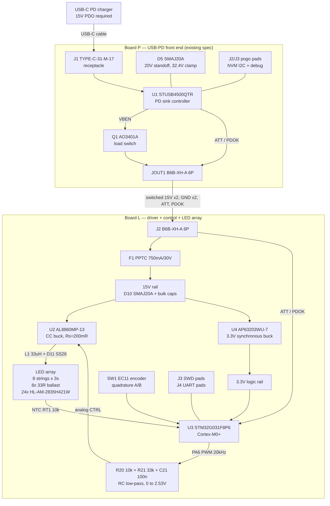

This section is the **locked prototype architecture**: the thing KiCad work starts
from. Everything here is a decision with a recorded reason that traces back to the
[power](/docs/power/board-p-front-end/) and [research](/docs/research/led-candidates/)
sections. Where those pages enumerated options, this section picks one and says why —
see [Decisions](./decisions.mdx) for the chosen-vs-rejected record.

:::warning[Nothing here is bench-confirmed]
Board P's topology was never validated on working hardware (see
[Lessons Carried From zudo-pd](/docs/power/lessons-from-zudo-pd/)), and Board L is a
new design that has never existed as a PCB. This is a datasheet-grounded paper design.
Treat the first build as the first real test, and follow the bring-up gates in
[Next Steps](./next-steps.mdx).
:::

## Headline numbers

| Parameter | Locked value |
|---|---|
| Board count | **2** — Board P (USB-PD front end) + Board L (driver, LEDs, control) |
| PD contract | 15 V / 3 A (45 W cap) |
| System draw | **~6.2 W, ~410 mA** — 13.7% of the contract cap, **7.3x margin** |
| LED array | **24x** SMD2835 warm white, 8 parallel strings of 3 series |
| CCT / CRI | 3000 K (2800–3100 K bin), CRI Ra ≥ 80 |
| Drive current | **500 mA** total, 62.5 mA per string |
| Light output | **~700 lm typical, ≥620 lm worst-case bin** |
| Driver | AL8860MP-13 constant-current buck, hysteretic, ~440 kHz |
| Logic rail | 3.3 V from an AP63203 synchronous buck |
| MCU | STM32G031F8P6 (Cortex-M0+, 64 KB flash, TSSOP-20) |
| Knob | EC11 rotary encoder → **base brightness** |
| Dimming | Analog (RC-filtered 20 kHz PWM into the driver's CTRL pin) — no visible flicker by construction |
| Board L dissipation | ~6.1 W spread over 24 LED sites + 8 ballast resistors — plain FR-4, no MCPCB |

## System block diagram

## Board split

**Two boards, no LED daughterboard.** Board P must be its own PCB (it is a reusable
switched-15 V sink module, and it has to be bench-brought-up alone before anything is
connected to it). Everything else lands on Board L.

The case for a third board — an LED module on aluminum MCPCB — was evaluated and
**rejected**. The [thermal budget](/docs/research/thermal-budget/) page sets the plain-FR-4
ceiling at roughly **1 W per LED site**; this design runs **0.19 W per site** across 24
sites. That is squarely in that page's "many small sites, generous pour" regime, not the
concentrated-COB regime that forces metal core. A third board would add a second
interconnect carrying the driver's switching node over a cable — a real EMI cost — to
solve a thermal problem this design does not have.

:::note[The split boundary is still designed in]
The LED array is drawn as a self-contained block with a **4-net interface**: `LED_P`
(array anode rail), `LED_N` (common cathode = the driver's switching node), `NTC_SENSE`,
and `GND`. If the later enclosure phase forces the emitters onto a separate plane from
the knob, the array can be lifted onto a daughterboard across exactly those four nets
without touching the rest of Board L. The reason it is not split *now* is the `LED_N`
switching node: running a ~440 kHz, 15 V-swing node down a wire harness is an EMI
problem that only pays for itself if the mechanics actually demand it.
:::

## Interfaces

| Interface | Physical | Nets |
|---|---|---|
| Charger → Board P | USB-C receptacle (J1) | CC1, CC2, VBUS, GND |
| Board P → Board L | JST XH 6-pin harness, 2.5 mm pitch, both ends `B6B-XH-A(LF)(SN)` | 1,2 = switched 15 V (paired); 3 = ATT; 4 = PDOK; 5,6 = GND (paired) |
| Board P programming | J2 pogo pads 1x4 (I2C NVM + reset), J3 pogo pads 1x8 (debug) | SCL, SDA, GND, RESET |
| Board L programming | J3 pad group 1x5, 2.54 mm (SWD) | SWDIO, SWCLK, NRST, 3V3, GND |
| Board L debug | J4 pad group 1x3, 2.54 mm (UART) | PA2 TX, PA3 RX, GND |
| User control | EC11 rotary encoder, panel-mount bushing | A, B, common |

The XH connector's per-contact current math is inherited unchanged from
[Board P's downstream interface](/docs/power/board-p-front-end/#downstream-interface):
3 A/contact nameplate, doubled contacts per rail. Against this design's actual 410 mA
draw that is **14x** derated margin per contact, not the 1.6x the connector was sized
for against the 3 A contract cap. The doubling stays anyway — it costs nothing, it is
already in Board P's spec, and it keeps the harness reusable if a brighter revision
raises the current.

## What the knob does

The knob sets **base brightness**, and nothing else. Speed and depth of the fire/wave
modulation are firmware constants. The full reasoning is in
[Decisions](./decisions.mdx#control-scheme); the short version is that a lamp knob that
does not change brightness is a surprise, and the chosen EC11 SKU's push-button presence
could not be confirmed from the parts DB, so a mode-cycling gesture cannot be relied on.

## Where to go next

| Page | Contents |
|---|---|
| [Board P](./board-p.mdx) | Locked front-end spec, full net table, interface pin assignment |
| [Board L](./board-l.mdx) | Driver/control/LED design, full pin-level net table, all component values with worked math |
| [Final BOM](./bom.mdx) | Every part, C-number, tier, stock, and the Extended-fee arithmetic |
| [Decisions](./decisions.mdx) | Chosen vs rejected per slot, with reasons |
| [Next Steps](./next-steps.mdx) | The KiCad phase — bring-up order, footprint pipeline, risks |
