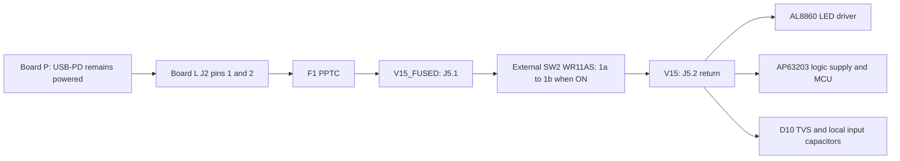

The selected switch is **NKK WR11AS**, a black, non-illuminated, maintained
ON/OFF rocker with epoxy-sealed **solder lugs**. It mounts in the enclosure and
connects to Board L through two wires. The encoder continues to set brightness.

## Selection and availability

The user preferred the appliance-style rocker if stocked. On **2026-09-05**,
[DigiKey's exact WR11AS listing](https://www.digikey.com/en/products/detail/nkk-switches/WR11AS/379592)
showed **8 immediately available, plus 94 factory stock**, at **US$21.94 for one**.
Factory stock is separate from immediately shippable distributor stock. A
[Mouser listing](https://www.mouser.co.uk/en/ProductDetail/NKK-Switches/WR11AS?qs=sGAEpiMZZMtFyPk3yBMYYPFvUbFOir2HXZ6HEEWKoew%3D)
also listed 23. These are dated observations, not reserved inventory; verify stock,
shipping to Japan and delivered price before ordering. No parts have been purchased.

The fallback discussed during planning was Dailywell **1MS1T1B1M1QES-5 / C496154**
(571 listed at LCSC, about US$0.98 each), followed by NKK **MN11SS1W01**. These toggles
are alternatives for a future reviewed revision, not interchangeable BOM substitutes.
The stock condition was satisfied, so **WR11AS is the locked selection**.

The [manufacturer WR catalog](https://www.nkkswitches.com/pdf/WR.pdf), pages
B124, B126 and B127, supports the rating and exact terminal/mounting details below.
The [component record](/docs/components/records/wr11as/) retains the evidence and
open qualification domains.

## Where the switch connects

| Endpoint | Connect to | Meaning |
|---|---|---|
| Board L J5 pad **1** | SW2 solder lug **1a** | `V15_FUSED`, positive supply after F1 |
| SW2 solder lug **1b** | Board L J5 pad **2** | `V15`, switched positive return feeding both converters |
| SW2 terminal **1** | **Does not exist** | The WR12 drawing includes a terminal that WR11 omits |

ON connects **1a–1b**; OFF opens them. Read the manufacturer's **terminal-side
view**, identify the actual lug markings, and verify continuity before wiring.
Do not infer ON direction from a photograph. WR11AS has no actuator marking:
mark **I / O** on the enclosure after checking the installed orientation.

`GND`, `ATT` and `PDOK` remain connected as before. Both positive contacts of J2
join **before F1**, so neither can bypass the switch. D10 and the converter input
capacitors remain local to switched `V15`. No LED switching node runs through
this cable.

## Mechanical and hand-assembly details

- Panel cutout: **34.2 × 17.2 mm, each +0.3 / −0 mm**, panel thickness **1–4 mm**.
  Check the B127 drawing and actual enclosure material/fit before cutting.
- Use the **S solder-lug** variant. The F quick-connect and L factory wire-lead
  versions are different orderable parts.
- Project harness choice: two **22 AWG stranded copper wires**, insulation rated
  at least **60 V and 105 °C**, each **150 mm or shorter**. Route them together,
  away from LED heat and switching nodes. This is a prototype construction choice,
  not a manufacturer-approved harness specification or a 15 A system rating.
- J5's custom bare PCB solder points have **5.08 mm pitch**, **1.3 mm holes** and
  **3 mm pads**. Verify the actual stripped wire fits the finished plated hole.
  Provide enclosure strain relief; solder joints must not carry cable pull loads.
- Insulate each switch lug separately with heat shrink, secure the harness, and
  keep exposed conductors clear of the chassis and PCB. Follow the manufacturer's
  soldering Profile A guidance referenced by the WR catalog.
- The catalog specifies **IP67 at the front panel and IP60 behind the panel** for
  this solder-lug variant. This does not make the lamp waterproof.

SW2 is included in the **system BOM**, marked **off-board**, and has no PCB
footprint, CPL placement or fabricated 3D preview. J5 is an **on-board bare-copper
feature**, excluded from the orderable BOM/CPL. Buy the switch separately as
**DigiKey 360-1507-ND / NKK WR11AS**, then hand-wire it.

:::note[PCB interface is now routed]
`board-l.kicad_pcb` includes J5 on the rear side: pad 1 connects to F1.2
(`V15_FUSED`), and pad 2 returns to `V15`. The old direct F1-to-V15 copper
connection has been removed. SW2 remains an external panel component.
See [rear controls and enclosure handoff](./rear-controls.mdx) for placement,
verification and the remaining mechanical prototype checks.
:::

## What OFF and ON mean

OFF disconnects Board L's **normal positive input supply**, turning off the LED
and logic converters after stored charge decays. **Board P and USB-PD remain
powered** while the USB cable is connected. OFF is not complete USB isolation.
Unplug USB and disconnect debug/programming equipment before servicing.

After V3P3 has decayed below the reset threshold, ON restarts the converters and
MCU. A rapid OFF/ON may retain enough charge to avoid reset; no active discharge
circuit was added. Confirm that behavior during bring-up. ON does not bypass the existing
PD-status, startup or thermal gates. Brightness restoration is **not implemented
by this hardware change**; firmware must initialize brightness deliberately. This
repository's control examples are not evidence of flashed or tested firmware.

An externally powered SWD/UART device may feed an otherwise unpowered circuit.
Do not claim OFF isolation with service cables attached; keep them disconnected
for the normal-use OFF test, then evaluate each service configuration separately.
The attached Board P status outputs also need an off-state back-power check.

## Rating and qualification boundary

The switch is rated **15 A at 30 V DC for resistive load**. The lamp's nominal
budget is **approximately 0.41 A at 15 V**, not 15 A. F1, wiring and board limits
continue to govern the lamp. A DC resistive nameplate does not prove capacitor
inrush endurance or low-current contact reliability.

C10, C11, C12 and C14 total 40 µF nominal; C13 adds 0.1 µF. Their nominal input
energy is `0.5 × 40.1 µF × (15 V)² = 4.51 mJ`. MLCC bias/tolerance, source
impedance, harness inductance, both converter loads and switch bounce change the
actual waveform. This estimate is **not a peak-current bound or lifetime test**.
The retained WR catalog does not establish a minimum applicable contact load or
capacitive-load life. Qualify repeated switching at full and minimum brightness,
and after idle/storage, before a production build.

The existing upstream surge/TVS envelope remains open. A 30 V switch rating is
not proof of survival at an upstream TVS's conditioned clamp voltage.

## Bring-up checks

1. With every supply disconnected, check J5.1→1a and 1b→J5.2, installed I/O
   orientation, wire insulation/strain relief, and no PCB bypass. Verify the
   rocker is open in OFF and closed in ON.
2. Bring up Board P alone first. With SW2 OFF, connect the lamp using a
   current-limited setup appropriate to the existing bring-up sequence. Measure
   V15 and V3P3 decay/off-state voltage; confirm no LED glow or MCU partial power.
3. Scope J5 feed/return, input current, V3P3 and CTRL during ON, OFF, rapid
   toggles and USB reconnects with the rocker in either position. Check bounce,
   inrush, overshoot, brownout cycling and visible startup flashes.
4. Verify safe startup and thermal protection still function; test full/minimum
   brightness and repeated cold/hot switching. Check contact drop and harness
   temperature. Record measurements rather than assuming nameplate margin is proof.
5. Separately assess ATT/PDOK and each SWD/UART service connection for back-power.
   Do not connect an external programmer supply to the switched-off lamp unless
   that service configuration has been reviewed.

These are **unperformed hardware gates**. Software checks prove generated nets,
terminal mapping and PCB/BOM exclusions; they cannot prove assembled behavior.
