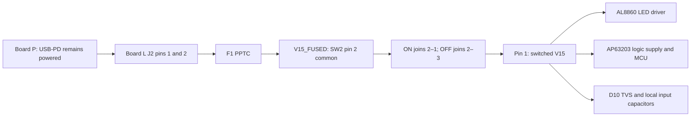

The selected switch is **Dailywell 1MS1T1B1M1QES-5 / C496154**, a maintained
SPDT toggle assembled directly on the back of Board L. One throw provides ON;
the other is left unwired for OFF. The existing encoder controls brightness.

## JLCPCB supplies the selected switch

On **2026-09-06 JST**, the [exact JLCPCB listing](https://jlcpcb.com/partdetail/C496154)
showed **1,080 in stock**, **995 available to order**, **Extended**,
**Wave Soldering**, and **Economic and Standard PCBA**. The quantity-one price
was US$1.1485 before assembly, shipping and tax. These are dated observations,
not reserved inventory; recheck the exact C496154 line when placing the PCBA order.
No order has been placed.

This replaces the earlier NKK WR11AS selection, which did not meet the JLCPCB
sourcing requirement. SW2 now has an LCSC identifier, PCB footprint, BOM/CPL
entry and actual KiCad 3D model. The old J5 wire-pad pair and switch harness are removed.

The [exact Dailywell drawing](https://datasheet.lcsc.com/datasheet/pdf/6c3cd0923a3d432d426a54ab841f4e91.pdf?productCode=C496154)
was retrieved from LCSC and matched the JLCPCB copy byte-for-byte. Its title is
1MS1T1B1M1QES-5, drawing 1MSP0694, revision B with a 2017 temperature amendment.
The [component record](/docs/components/records/c496154/) includes the drawing,
footprint, interactive model and retained evidence. Manufacturer-authored content
retrieved through a distributor remains mirror evidence under the audit contract.

## The switch disconnects the normal positive feed

| Terminal | PCB connection | Behavior |
|---|---|---|
| **2, common** | `V15_FUSED`, directly from F1.2 | Powered whenever the normal input is present |
| **1** | `V15`, feeding both converters and D10 | Connected to common in lamp ON |
| **3** | Explicit schematic NC; isolated PCB pad | Connected to common in lamp OFF, so **electrically live in OFF** |

The manufacturer specifies maintained **ON–NONE–ON**, with no centre position.
Its position 1 connects 2–3; position 3 connects 2–1. “OFF” means the lamp load is
disconnected, not that every switch terminal is de-energized. Never connect pin 3
to ground. Confirm continuity and mark I/O on the enclosure using the installed
orientation, not a product photograph or the model's illustrated lever position.

Both J2 positive contacts join before F1, so neither bypasses SW2. `GND`, `ATT`
and `PDOK` remain connected. D10 and the input capacitors stay local to switched
`V15`; no LED switching node passes through the control.

## Plated slots and panel support accommodate the exact part

Dailywell calls this variant **solder lug / panel mounting**, despite the supplier's
generic “PC Pin” attribute. The exact supplier footprint uses plated slots for those
lugs, and JLCPCB lists wave-solder assembly. The project enlarges the imported
slots to **4.0 × 2.4 mm**, with **5.0 × 3.4 mm copper pads**, at **4.7 mm pitch**.
The 8 × 14 mm courtyard includes body margin.

The slot calculation includes the drawing's dimensional/angular tolerances,
rounded slot ends, JLCPCB's published +0.13/−0.08 mm slot-size tolerance and a
stated registration allowance. It leaves approximately **0.030 mm worst-case
corner clearance** and **0.385 mm annulus** under those assumptions. The full
calculation and source hashes are retained in `footprints/vendor/C496154/README.md`.
This is a project-adapted footprint, not a manufacturer land pattern or proof
that JLCPCB has approved this particular board's insertion and soldering details.

Secure the **1/4-40 UNS-2A threaded bushing** with the enclosure and nuts, so
actuation does not load the solder joints. The drawing shows a 6.35 mm panel
opening with keyway details; the optional locking-ring arrangement adds a
2.38 mm locating hole 6.10 mm from centre. Body and bushing lengths are each
8.89 mm; the lever projects a further 10.41 mm. Reserve a support plane through
the bushing and sufficient thread engagement for the hardware. Final panel
thickness and nut stack remain enclosure prototype choices.

SW2 sits at **(9.10, 27.75) mm on B.Cu**. See the
[rear-controls handoff](./rear-controls.mdx) for stack clearance and the actual
PCB render. Its lugs project approximately **1.9 mm past the front of a 1.6 mm
PCB**, plus solder; check that space against LEDs and the light chamber.

## OFF and ON still need hardware qualification

OFF disconnects Board L's normal positive supply. LEDs and logic turn off after
stored charge decays. **Board P and USB-PD remain powered** while USB is connected.
Disconnect USB and service cables before handling the assembly.

ON restarts the converters and MCU after sufficient rail decay. Rapid OFF/ON can
retain charge and avoid reset; no active discharge circuit was added. Startup,
PD-status and thermal gates remain unchanged. Brightness restoration is not
implemented by this hardware revision; firmware must initialize it deliberately.

The exact drawing lists **5 A at 28 VDC** for Q silver contacts, compared with the
lamp's nominal **0.41 A at 15 V** design estimate. It does not identify a load-type
qualifier or prove capacitive-inrush endurance or low-current contact reliability.
F1 and board limits still govern the system.

C10/C11/C12/C14 total 40 µF nominal; C13 adds 0.1 µF. Their nominal stored energy
at 15 V is `0.5 × 40.1 µF × (15 V)² = 4.51 mJ`. This is not a peak-current or
lifetime bound. Capacitance bias, source impedance and contact bounce affect the
actual waveform. The existing upstream surge/TVS qualification remains open.

## Bring-up checks

1. Unpowered, verify terminal numbering, 2–1 ON and 2–3 OFF, no copper bypass,
   and isolation of pin 3 from every PCB net. Check slots, solder fill, bushing
   support, front lug clearance and installed I/O labels.
2. Bring up Board P first. With SW2 OFF and service cables disconnected, use the
   existing current-limited bring-up procedure. Measure V15/V3P3 decay and residual
   voltage; check for LED glow or partial MCU power.
3. Scope input current, V15, V3P3 and CTRL during ON, OFF, rapid toggles and USB
   reconnection. Check inrush, bounce, overshoot, brownout cycling and startup flashes.
4. Test full/minimum brightness, repeated switching, idle/storage recovery, contact
   drop and temperature. Verify startup and thermal protection still function.
5. Separately assess ATT/PDOK and SWD/UART back-power. An externally powered
   service interface can energize the load even when its normal supply is open.

These are unperformed hardware checks. ERC, netlist checks, DRC and 3D rendering
verify design data; they do not prove assembled operation or enclosure fit.
