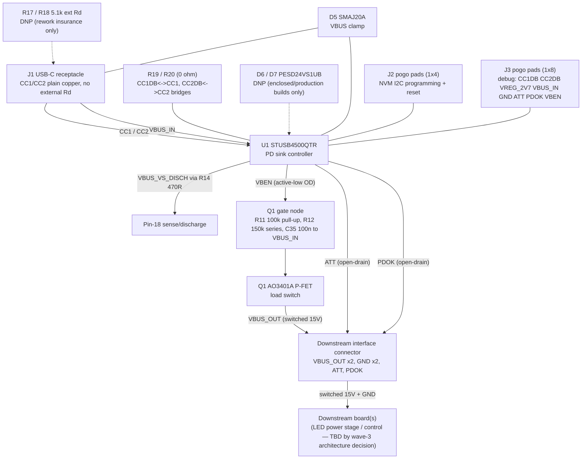

Board P is this lamp's dedicated USB-PD processing board. It negotiates a 15 V/3 A
USB-PD contract from a USB-C charger, load-switches it, and hands a clean switched
15 V rail (plus GND and two optional status flags) to whatever board consumes power
downstream — the LED power stage and/or control board being researched in parallel as
separate doc sections. The exact board split is locked by the prototype-architecture
decision, not by this page.

The circuit below is adapted from the **zudo-pd project**'s "Board A" — a small,
reusable USB-PD 15 V sink module the zudo-pd project split out specifically so other
projects could reuse it. This page is an **audit**, not a copy-paste: every LCSC part
number was re-verified against the local JLCPCB parts database, and rating claims were
checked against the cited manufacturer, manufacturer-mirror, or catalog evidence.
Evidence authority is explicit; mirror/catalog records do not receive primary-source
trust. One part failed the rating check — see
[Worst-Case Ratings Matrix](./ratings-matrix.mdx) for the USB-C receptacle swap this
audit made.

:::note
This is a documentation-only deliverable, same as zudo-pd's own Board A page. No
`.kicad_sch` / `.kicad_pcb` file exists for Board P yet — that is a later KiCad phase
per the epic's scope boundaries. The net table below describes the circuit Board P's
schematic should implement; reference designators (U1, Q1, J1, D5, R11–R20, C1/C2/C30/
C34/C35) are carried over from zudo-pd's Board A for continuity, not from an existing
Board P schematic.
:::

## Purpose

- **Proven front-end topology.** zudo-pd's single-board design failed USB-PD
  negotiation across four separate PCBA orders (v1–v4) before the front end was
  diagnosed, fixed on paper, and split into its own board. Board P inherits that
  post-fix topology directly, rather than re-deriving it from scratch.
- **Generic, reusable "switched 15 V sink" module.** Nothing in this circuit is
  lamp-specific — it negotiates 15 V over USB-PD, switches it, and exposes GND plus
  two generic status flags. Any downstream board that just needs a switched 15 V rail
  can consume it.
- **NVM-programmable.** The same board carries I2C pogo pads for writing the
  STUSB4500's PDO configuration — see
  [Lessons Carried From zudo-pd](./lessons-from-zudo-pd.mdx) for the factory-default
  20 V trap this NVM step exists to close.

## Block diagram

## Net-connectivity table

Per the zudo-pd project's net-table + Mermaid convention (a "never ASCII-art
schematics" documentation rule — connectivity is recorded as a table derived from
netlist data, illustrated at block level by Mermaid). This table describes the target
circuit for Board P's own future schematic; it is not yet exported from a KiCad
netlist because that schematic does not exist yet.

| Net | Connected pins (Ref.Pin) | Value/Note |
|-----|--------------------------|------------|
| `VBUS_IN` | `J1.A9 J1.B9 U1.VDD C1.2 C2.2 C35.2 R14.1 R11.2 Q1.S J3.4 D5.cathode` | Receptacle VBUS (5 V pre-contract, 15 V post-contract). `U1.VDD` direct (operating range 4.1–22 V, absolute max 28 V — see [ratings matrix](./ratings-matrix.mdx)). `C1` 10 µF + `C2` 100 nF decoupling. `C35` returns the gate capacitor to `VBUS_IN`. `D5` cathode = SMAJ20A VBUS clamp |
| `CC1` | `J1.A5 U1.CC1 R17.1(DNP) R19.2 D6.1(DNP)` | Connector CC1 to `U1.CC1` is plain copper. `R17` (5.1 kΩ external Rd) is DNP — see [lessons](./lessons-from-zudo-pd.mdx) for why. `R19` (0 Ω, fitted) bridges `CC1DB↔CC1`. `D6` = PESD24VS1UB, DNP |
| `CC2` | `J1.B5 U1.CC2 R18.1(DNP) R20.2 D7.1(DNP)` | Mirror of CC1 |
| `CC1DB` | `U1.CC1DB R19.1 J3.1` | Dead-battery pin. `R19` (0 Ω) bridges to `CC1` net — restores ST's VBUS-only-sink reference topology (DS12499 §3.5) |
| `CC2DB` | `U1.CC2DB R20.1 J3.2` | Mirror; `R20` bridges to `CC2` |
| `VBUS_VS_DISCH` | `U1.pin18 R14.2` | Pin-18 sense/discharge node. `R14` 470 Ω series from `VBUS_IN` |
| `VBEN` (VBUS_EN_SNK) | `U1.pin16 R12.1 J3.8` | Active-low open-drain. `R12` is the generated 150 kΩ C22807 series part to the gate node |
| `Q1_G` | `Q1.G R11.1 R12.2 C35.1` | Q1 gate. Generator evidence places `R11` 100 kΩ and `C35` 100 nF between `Q1_G` and `VBUS_IN`; this topology does not justify the obsolete gate-to-ground RC time-constant claim |
| `VBUS_OUT` | `Q1.D R13.1 JOUT1.1 JOUT1.2` | Switched output of the load switch — the reusable "switched 15 V sink" rail, paired across two downstream connector pins for current sharing |
| `DISCH` | `U1.DISCH R13.2` | DISCH pin → `R13` 470 Ω → `VBUS_OUT` (system-side discharge) |
| `VREG_2V7` | `U1.VREG_2V7 C30.2 R15.2 R16.2 J3.3` | 2.7 V internal regulator / I2C pull-up rail. `C30` decap |
| `VREG_1V2` | `U1.VREG_1V2 C34.1` | 1.2 V internal digital-core regulator. `C34` decap |
| `SCL` | `U1.SCL R15.1 J2.1` | NVM programming clock. `R15` 4.7 kΩ pull-up to `VREG_2V7` |
| `SDA` | `U1.SDA R16.1 J2.2` | NVM programming data. `R16` 4.7 kΩ pull-up |
| `RESET` | `U1.RESET R21.1 J2.4` | R21 10 kΩ pull-down keeps the chip in run state; `J2.4` lets the programming jig assert a hardware reset if an NVM write leaves the I2C state wedged |
| `ATT` | `U1.ATTACH J3.6 JOUT1.3` | ATTACH flag, open-drain active-low, no on-board pull-up |
| `PDOK` | `U1.POWER_OK2 J3.7 JOUT1.4` | Asserts on a live PDO2/15 V contract, open-drain active-low, no on-board pull-up |
| `GND` | `U1.GND U1.ADDR0 U1.ADDR1 U1.VSYS U1.EP J1.GND C1.1 C2.1 C30.1 C34.2 R21.2 R17.2(DNP) R18.2(DNP) J2.3 J3.5 D5.anode D6.2(DNP) D7.2(DNP) JOUT1.5 JOUT1.6` | Common ground. `U1.ADDR0/1` → I2C address `0x28`. `U1.VSYS` grounded (VDD-only supply). `U1.EP` = exposed thermal/electrical pad |
| Unused U1 pins | `NC`, `POWER_OK3` (float), `GPIO` (float), `A_B_SIDE` (float), `ALERT` (float) | Same disposition as zudo-pd's Board A |

:::caution[VREG_2V7 external loading is an open item]
Pin 23 (`VREG_2V7`) is documented in the STUSB4500's pin map as decoupling-only, yet this
design loads it externally with the R15/R16 4.7 kΩ I2C pull-ups and exposes it on debug
pad `J3.3`. Closing this needs a datasheet locator that authorizes external DC load on
this pin (or a re-route decision, out of this page's scope), plus the constraint that the
NVM-programming jig's logic levels must match 2.7 V, not 3.3 V or 5 V. This must close
before the #34 programming artifact executes — tracked on
[#43](https://github.com/Takazudo/zudo-led-lamp/issues/43).
:::

:::warning
No 5 V-class USB ESD array (e.g. a USBLC6-2SC6-family part) belongs anywhere on this
board's VBUS path. See [Lessons Carried From zudo-pd](./lessons-from-zudo-pd.mdx) for
why zudo-pd's early revisions failed exactly this way.
:::

## Component list, LCSC parts, and rough cost

All LCSC numbers below were independently re-verified via the local JLCPCB parts
database (dated 2026-07-25) — not copied from zudo-pd's BOM page, which that project's
own docs flag as having drifted. `https://jlcpcb.com/partdetail/C{number}` links are
included for each. See [Worst-Case Ratings Matrix](./ratings-matrix.mdx) for the
per-part rating evidence and the one part this audit swapped out.

| Ref | Part | LCSC | Package | Role | Stock (DB 2026-07-25) |
|-----|------|------|---------|------|------------------------|
| U1 | STUSB4500QTR | [C2678061](https://jlcpcb.com/partdetail/C2678061) | QFN-24-EP (4×4) | PD sink controller | 4,562 |
| Q1 | UMW (Youtai Semiconductor) AO3401A | [C347476](https://jlcpcb.com/partdetail/C347476) | SOT-23 | Load switch (P-FET) | 862,120 |
| J1 | TYPE-C-31-M-17 | [C283540](https://jlcpcb.com/partdetail/C283540) | 6P SMD, right-angle | USB-C PD input — **replaces zudo-pd's C456012**, see [ratings matrix](./ratings-matrix.mdx) | 33,876 |
| D5 | SMAJ20A | [C571370](https://jlcpcb.com/partdetail/C571370) (alt [C1973455](https://jlcpcb.com/partdetail/C1973455)) | SMA | VBUS TVS clamp | 3,770 (alt: 1 — essentially depleted, use primary) |
| C1 | 10 µF 50V X5R | [C13585](https://jlcpcb.com/partdetail/C13585) | 1206 | VDD bulk decouple | 1,877,266 |
| C2 | 100 nF 50V X7R | [C14663](https://jlcpcb.com/partdetail/C14663) | 0603 | VDD HF decouple | — |
| C30 | 1 µF 50V X5R | [C15849](https://jlcpcb.com/partdetail/C15849) | 0603 | VREG_2V7 decouple | 5,979,916 |
| C34 | 1 µF 50V X5R | [C15849](https://jlcpcb.com/partdetail/C15849) | 0603 | VREG_1V2 decouple | 5,979,916 |
| C35 | 100 nF 50V X7R | [C14663](https://jlcpcb.com/partdetail/C14663) | 0603 | Gate-to-VBUS_IN capacitor | — |
| R11 | 100 kΩ | [C25803](https://jlcpcb.com/partdetail/C25803) | 0603 | Gate pull-up | 7,990,119 |
| R12 | 150 kΩ | [C22807](https://jlcpcb.com/partdetail/C22807) | 0603 | VBEN-to-gate series resistor | — |
| R13 | 470 Ω | [C23179](https://jlcpcb.com/partdetail/C23179) | 0603 | DISCH resistor | 1,899,614 |
| R14 | 470 Ω | [C23179](https://jlcpcb.com/partdetail/C23179) | 0603 | Pin-18 series R | 1,899,614 |
| R15 | 4.7 kΩ | [C23162](https://jlcpcb.com/partdetail/C23162) | 0603 | I2C SCL pull-up | 7,433,362 |
| R16 | 4.7 kΩ | [C23162](https://jlcpcb.com/partdetail/C23162) | 0603 | I2C SDA pull-up | 7,433,362 |
| R19 | 0 Ω | [C21189](https://jlcpcb.com/partdetail/C21189) | 0603 | CC1DB↔CC1 link (fitted) | 6,153,233 |
| R20 | 0 Ω | [C21189](https://jlcpcb.com/partdetail/C21189) | 0603 | CC2DB↔CC2 link (fitted) | 6,153,233 |
| R21 | 10 kΩ | [C17414](https://jlcpcb.com/partdetail/C17414) | 0805 | RESET pull-down (run state); shares Board L's reel | 10,726,008 |
| J2 | Pogo pads, 1×4 | — (bare copper, no part) | Custom SMD | NVM I2C programming | $0 |
| J3 | Pogo pads, 1×8 | — (bare copper, no part) | Custom SMD | Debug pads | $0 |
| JOUT1 | JST B6B-XH-A(LF)(SN) | [C144397](https://jlcpcb.com/partdetail/C144397) | THT, 2.5 mm pitch | Downstream interface connector | 47,935 |

**DNP (footprint only, not populated):**

| Ref | Part | LCSC | Package | Note |
|-----|------|------|---------|------|
| R17, R18 | 5.1 kΩ | [C23186](https://jlcpcb.com/partdetail/C23186) | 0603 | External Rd, rework insurance only — never populate on a powered build |
| D6, D7 | PESD24VS1UB | [C85382](https://jlcpcb.com/partdetail/C85382) | SOD-523 | CC-line ESD, enclosed/production builds only |

## Downstream interface

Board P exposes exactly what a "switched 15 V sink module" needs to hand off:
**switched 15 V (paired, 2 pins), GND (paired, 2 pins), and two optional open-drain
status flags** — ATT (cable attached) and PDOK (live 15 V PD contract). This mirrors
the interface contract zudo-pd's Board A uses toward its own downstream board, reusing
the same connector choice (JST B6B-XH-A(LF)(SN), 6-pin, 2.5 mm pitch, 3 A/contact) for
the same reasons: polarized/shrouded housing, genuine-JST stock at JLCPCB, and
through-hole anchoring appropriate for a power connector.

:::note
The exact downstream consumer (LED power stage, control board, or a single combined
board) is **not locked by this page** — that split is the prototype-architecture
decision's job. Nothing about Board P's interface assumes a particular downstream
split: a consumer that ignores ATT/PDOK just gets switched 15 V, same as zudo-pd's own
reuse guidance states.
:::

**Current-rating math** (same method zudo-pd used for its A↔B interface): worst case
is the PD contract cap of 3.0 A at 15 V. The XH connector is rated 3.0 A/contact; at an
80% continuous derate that is 2.4 A/contact. Two contacts per power rail give 4.8 A
derated capacity against a 3.0 A load — each contact carries 1.5 A, 50% of nameplate,
for a 1.6× derated margin (2.0× nameplate). GND uses the identical two-contact math.

## Reuse guidance

- **Minimum wiring:** connect the two `VBUS_OUT` pins and two `GND` pins to the
  consuming circuit. ATT/PDOK may be left unconnected — Board P negotiates and
  switches power autonomously.
- **NVM reconfiguration:** the negotiated voltage/current live in the STUSB4500's NVM,
  not in the schematic — see [Lessons Carried From zudo-pd](./lessons-from-zudo-pd.mdx)
  for the programming procedure and its pitfalls.
- **Electrical limits to respect downstream:** anything wired to `VBUS_OUT` must
  be assessed against the real protected-rail waveform, not just the nominal 15 V.
  D5's 32.4 V figure is one manufacturer table point at 12.3 A, 10/1000 µs, and
  25 °C; it is not a universal clamp ceiling or proof of the installed waveform.
  See [Worst-Case Ratings Matrix](./ratings-matrix.mdx) and the open
  [input-protection evidence gate](https://github.com/Takazudo/zudo-led-lamp/issues/34).

## References

- The zudo-pd project's Board A design (STUSB4500-based reusable USB-PD 15 V sink
  core) — the direct source of this circuit, credited throughout this page.
- [Worst-Case Ratings Matrix](./ratings-matrix.mdx) — conditioned exact-part rating
  evidence and the source, mapping, simulation, and bench stages that remain open.
- [Charger Compatibility](./charger-compatibility.mdx) — why the front end uses an
  auto-negotiating certified controller instead of a resistor-strapped one.
- [Lessons Carried From zudo-pd](./lessons-from-zudo-pd.mdx) — design rules, the NVM
  factory-default trap, JLCPCB CPL gotchas, and the standalone bring-up sequence.
